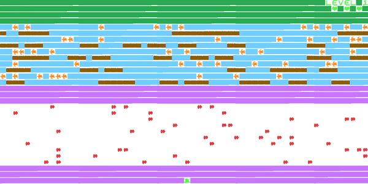
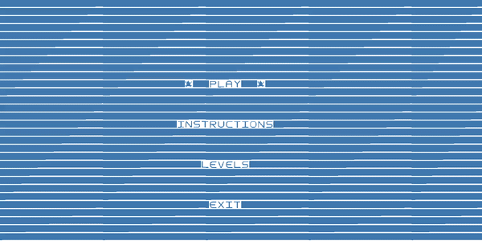
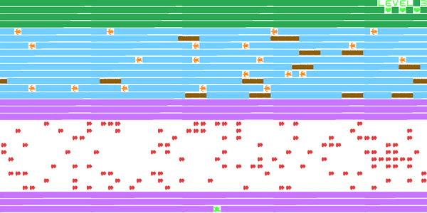
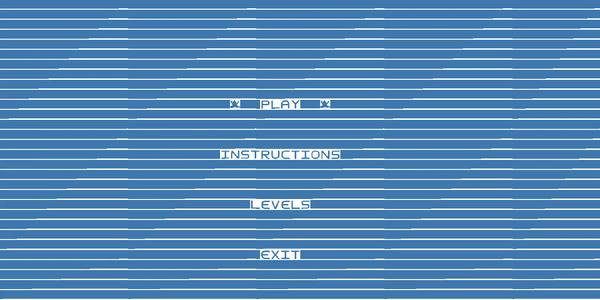
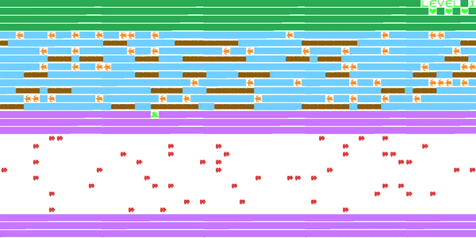

# LDTS_T06_G07 - FROGGER

## Game Description

The objective of the game is to direct Mr. Frog to its home (the grass) across three different levels. The final destination is reached by crossing a busy road and navigating a river full of dangers while avoiding being run over or falling into the water, which would result in the loss of a life. The only player control is the 4-direction arrow keys on the keyboard, used to navigate the frog. Each click in one direction causes the frog to hop once in that same direction.

This project was developed by Anete Pereira (up202008856@edu.fe.up.pt), Isabel Amaral (up202006677@edu.fe.up.pt) and Mafalda Magalhães (up201707066@edu.fe.up.pt) for LDTS 2021-22.

For a more detailed version of this description click [here](./docs/README.md).

## GUI Mockups

The following mockups illustrate our goal to the general look of our game:

### Game preview

### Menus

### Victory Screen

### Game Over Screen

### Instructions Menu

### Getting out of Screen

[comment]: <> (### Game preview)

[comment]: <> (![]&#40;./docs/images/game.png&#41;)

[comment]: <> (### Menus)

[comment]: <> (![]&#40;./docs/images/menu.png&#41;)

[comment]: <> (### Victory Screen)

[comment]: <> (![]&#40;./docs/images/victory.png&#41;)

[comment]: <> (### Game Over Screen)

[comment]: <> (![]&#40;./docs/images/gameOver.png&#41;)
