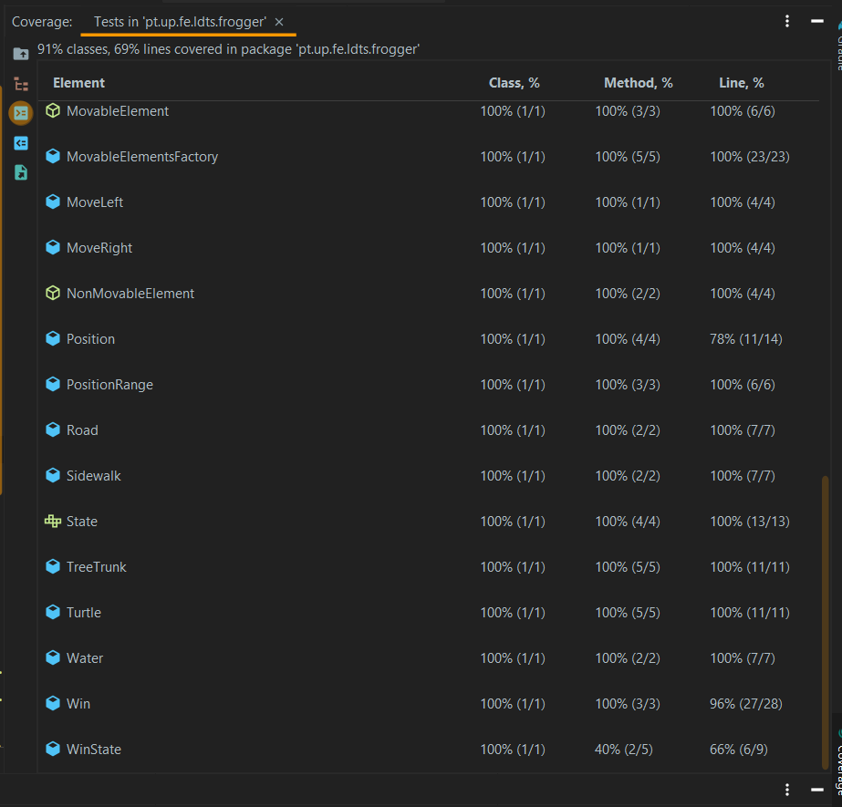

# LDTS_T06_G07 - FROGGER

## Game Description

The objective of the game is to direct Mr. Frog to its home (the grass) across three different levels. The final destination is reached by crossing a busy road and navigating a river full of dangers while avoiding being run over or falling into the water, which would result in the loss of a life. The only player control is the 4-direction arrow keys on the keyboard, used to navigate the frog. Each click in one direction causes the frog to hop once in that same direction.
This game is based on the classic Frogger game (https://www.free80sarcade.com/atari7800.php?cart=Froggie).

This project was developed by Anete Pereira (up202008856@edu.fe.up.pt), Isabel Amaral (up202006677@edu.fe.up.pt) and Mafalda Magalhães (up201707066@edu.fe.up.pt) for LDTS 2021-22.

## Implemented Features

- **Keyboard Control** -The keyboard inputs are received through the respective events.
- **Player control** - The player may move with the keyboard control.
- **Arena creation** - The arena is drawn in the Game class.
- **Elements creation** - All elements (movable and non-movable) are created at the beginning of the game.
- **Collisions detection** - Collisions between the frog and the remaining elements are verified. (Ex: Frog, Car, Turtle, Water, TreeTrunk, Grass).
- **Keyboard Control** - The keyboard inputs are interpreted according to the current game state.
- **Buttons on the Menu** - Functional and interactive buttons.
- **Connected Menus** - The user has the capability of browsing through the different menus. (Main Menu, Instructions, Play and Levels).
- **Different levels** - 3 different levels with an increasing difficulty (the velocity of the cars, tree trunks and turtles will be higher and there will be more cars and less tree trunks and turtles, making it more difficult to reach the grass).
- **Elements creation** - The creation of our movable game elements is be done randomly and according to the current game level.
- **Animations** - Some cool animations are incorporated in this game, when you win or lose the game or when you lose a life.
- **Quit** - The key 'q' or 'Q' can be used at any time to close the game.
 

## Design

### Introduction

We began this project by doing some tests for the basic classes - Game and Arena. Then, we made a UML to help us understand better the structure of our game. Since our game is dealing with a GUI and is divided by different gameStates, we found three design patterns that would be able to fullfil our features to be implemented in our game.

The three main patterns that were applied to the project, the **_Factory Method Pattern_**, which is used to create the movable elements in our project, the **_Command Pattern_** which allows us to keep constantly moving cars, turtles and tree trunks either to the left or to the right and the **_State Pattern_** which is a behavioral design pattern that lets an object alter its behavior as its internal state changes - in this case the four states are GameState (the user is playing), MenuState (the user is in the Menu screen), WinState (the user won the game) and the loseState (the user lost the game). 

### Creation of Elements

#### Problem in Context:
Our game arena consists in a large agglomeration of movable elements such as cars, tree trunks and turtles,
as well as a single frog. Given the need of having different arenas with different complexities in each one of
the three levels, we found that having one single factory class (MovableElementsFactory) responsible for randomly
creating the different instances of MovableElement objects according to the current game level, passed to this class as an attribute,
was an easier solution than just having a concrete creator for each level.

#### The Pattern:
The **_Factory Method_** is a creational design pattern that lets us create objets of a superclass, while also allowing
us to have subclasses to alter the type of objects that will be created.

#### Implementation:
Regarding the implementation, we now have classes which main purpose is to create new movable elements
(CreateCar, CreateFrog, CreateTurtle and CreateTreeTrunk).

#### Consequences:
The use of this pattern in the current design allows the following benefits:
- The Factory Method separates product construction code from the code that actually uses the product, making
it easier to extend the product construction code independently of the rest of the code.
- A well organized code that has the product creation code into only one place in the program, making it easier
to fix bugs and easier to change.
- Easy to add new objects throughout the development stage, if needed.

### Two Different Types of Commands 
#### Problem in Context:
Most of our MovableElement objects (the cars, tree trunks and turtles) will be in constant motion, either to the
left or to the right. This movement will be independent of the object's class. Whether the object is a Car, a TreeTrunk
or a Turtle, it will always move either to the left or to the right, according to the traffic/river lane 
where it's located, and in a certain speed.

#### The Pattern:
We have applied the **_Command pattern_** which is a behavioral design pattern that turns a request into a stand-alone object that contains 
all information about the request. This means that an object is used to encapsulate all information needed to perform an action in the future 
(MoveRight and MoveLeft classes).

#### Implementation:
This pattern is implemented by having a single class, the Command class, with a single execution method (execute). Then, we have two classes (MoveLeft and MoveRight) 
that inherit this execute method, allowing us to overwrite it accordingly to our wishes. The MoveLeft class moves objects to the left and the MoveRight
class moves them to the right.

#### Consequences:
Some consequences of using the stated pattern:
- Promotes the single responsibility principle, which means the Command class and its subclasses are the only
accountable for moving the elements mentioned above since they have similar behaviour.
- Clean code.

### State of the Game
#### Problem in Context:
In our game we need to be able to change between the menu, the game itself, the 'victory' screen and the 'game over' screen.
The easiest way to do this without duplicating code is to have a state attribute that allows us to know what are we 
supposed to be seeing or doing according to our current state in the game.

#### The Pattern:
The **_State Pattern_** allows us to keep state-specific behaviors by having subclasses for these different states. It is a behavioral design pattern 
that lets an object alter its behavior when its internal state changes, appearing as if the object has changed its class. 

#### Implementation:
A State class is responsible for keeping the current state of the game and its methods make it possible to change between the different states of our 
program - GameState, MenuState, WinState and LoseState.

#### Consequences: 
The benefits of applying the above pattern are:
- We can organize the code related to particular states into separate classes, without having to use switch clauses - Single Responsibility Principle.
- We can introduce new states in the game without changing the existing state classes - Open/Closed Principle.
- Makes state transitions explicit.

## Known Code Smells And Refactoring Suggestions
#### **Large Class**
The class Arena contains many methods. In our opinion, we need to implement it this way because it is in this
class that most of the action occurs (movements of Frog and verify collisions).
The overall structure of the code could have been improved if we had used the Model-View-Controller design pattern, since
this would have allowed us to keep each one of our classes very focused on one specific task.

#### **Refused bequest**
In an attempt to generalize and simplify our code, we created some abstract classes and some interfaces, resulting
in the rising of the **Refused bequest** smell. As a result, some subclasses inherited methods from its parent 
classes which are neither defined nor used (ex: State subclasses).

#### **Duplicate code**
In some parts of the code we have some kind of similar logics being executed several times in different methods.
For example, in the moveTurtles and moveTreeTrunks methods the code is similar and perform the same job, but for different elements.

#### **Switch statements**
We use instances of switch cases to handle Key Actions. However, we could not find an easier way to read the input
given by the user and the switch statement performs a really simple task.

## Testing

### Screenshot of coverage report

### Pitest

You can see the folder with the pitest report [here](https://github.com/FEUP-LDTS-2021/ldts-project-assignment-g0607/tree/master/build/reports/pitest/202201292224).  

## Self-evaluation
The work was divided equally between all the elements of the group. While some classes and tests were
initially started by one of us, eventually everyone contributed to implementing some aditional methods, fixing
bugs and errors and everyone was always available to help.

- Anete Pereira: 33.3%
- Isabel Amaral: 33.3%
- Mafalda Magalhães: 33.3%
